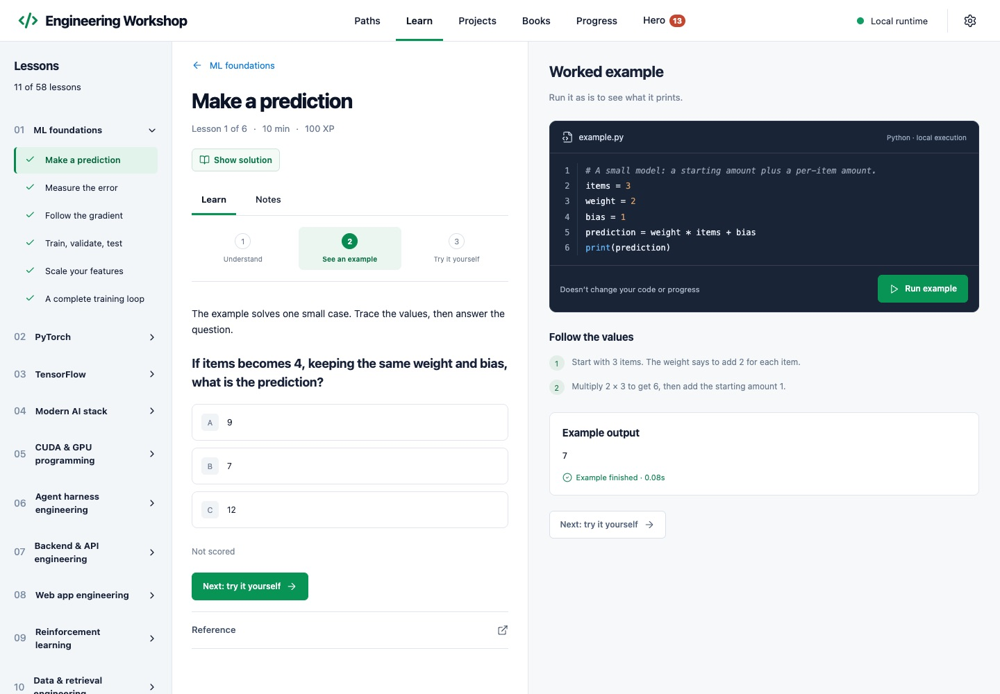
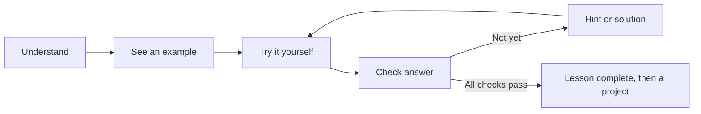

# Engineering Workshop

[](https://github.com/ShmalexM/ml-workshop/actions/workflows/ci.yml)
[](LICENSE)

Practice ML and software engineering in **58 short lessons across 12 paths**, using Python and JavaScript: ML basics, PyTorch, TensorFlow, CUDA, agent harnesses, backends, web apps, reinforcement learning, retrieval, reliability, and interactive systems. Each lesson explains one idea, runs a worked example, then gives you an exercise with automatic checks. Projects show where the same ideas appear in public code.

Built for an experienced programmer broadening their engineering skills. The recommended ML path still starts with fundamentals. The repository and existing launcher keep the `ml-workshop` name for compatibility. Inspired by the learn-by-doing format of Boot.dev, with original curriculum and interface. This is an independent project with no affiliation with Boot.dev or the framework authors.



## Install

Paste one line into a terminal and press Enter. You don't need to install anything first, and you don't need admin rights.

**macOS or Linux:** open Terminal and run

```sh
curl -fsSL https://raw.githubusercontent.com/ShmalexM/ml-workshop/main/install.sh | sh
```

**Windows 10 or 11:** open PowerShell from the Start menu and run

```powershell
irm https://raw.githubusercontent.com/ShmalexM/ml-workshop/main/install.ps1 | iex
```

The installer downloads Engineering Workshop, Python 3.12 and the ML libraries (about 2 GB). It also downloads Node.js if your computer doesn't have version 22.13 or newer. The first install can take a while. When it finishes, Engineering Workshop opens in your browser.

To open it later:
- **macOS:** search for Engineering Workshop in Spotlight. The app is in the Applications folder inside your home folder.
- **Linux:** find Engineering Workshop in your applications menu.
- **Windows:** use the Engineering Workshop shortcut in the Start menu or on the desktop.

Everything goes into one folder: `~/.local/share/engineering-workshop` on macOS and Linux, `%LOCALAPPDATA%\EngineeringWorkshop` on Windows. Your progress is in its `data` folder. Apart from the shortcut, nothing else on your computer changes.

**Update:** run the same command again. Your progress is kept.

**Uninstall:** run the command for your system. Your progress stays in the `data` folder.

```sh
curl -fsSL https://raw.githubusercontent.com/ShmalexM/ml-workshop/main/install.sh | sh -s -- --uninstall
```

```powershell
& ([scriptblock]::Create((irm https://raw.githubusercontent.com/ShmalexM/ml-workshop/main/install.ps1))) -Uninstall
```

To delete your progress as well, add `--purge` (macOS, Linux) or `-Purge` (Windows) to the end.

- No curl on Linux? Replace `curl -fsSL` with `wget -qO-`.
- On Intel Macs, PyTorch and TensorFlow are no longer available, so the installer skips the ML libraries. The PyTorch, TensorFlow, Modern AI stack and CUDA lessons need them; all other lessons work. The same happens on any computer where the ML libraries fail to install.
- To change the code, use a Git clone instead. See [Develop and contribute](#develop-and-contribute).

## What you'll learn

| Path | Lessons | Topics |
| --- | ---: | --- |
| ML foundations | 6 | Predictions, loss, gradients, data splitting, and training |
| PyTorch | 6 | Tensors, broadcasting, autograd, modules, optimization, and inference |
| TensorFlow | 6 | Tensors, GradientTape, Keras, training, datasets, and inference |
| Modern AI stack | 6 | Hugging Face, tokenization, LangChain, LlamaIndex, and retrieval |
| CUDA & GPU programming | 6 | Thread/block indexing, bounds, transfers, 2D kernels, and shared memory |
| Agent harness engineering | 4 | State machines, tool contracts, budgets, and trace evaluation |
| Backend & API engineering | 4 | Input validation, idempotency, pagination, and readiness |
| Web app engineering | 4 | JavaScript reducers, stale responses, derived views, and saved-state migration |
| Reinforcement learning | 4 | Environment contracts, returns, exploration, and terminal/truncated targets |
| Data & retrieval engineering | 4 | Revision deduplication, chunking, bounded graph walks, and recall |
| Shipping & reliability | 4 | Retry budgets, structured redaction, change plans, and release gates |
| Interactive & native systems | 4 | Lifecycle, frame time, aspect ratios, and event replay |



Use **Run code** (⌘ Enter; Ctrl Enter on Linux and Windows) to see output, then **Check answer** (⌘ Shift Enter; Ctrl Shift Enter) to run the checks and earn XP. XP is awarded once per lesson. You can open any lesson, reveal hints in order, and view the solution. **Paths** suggests an order by role, and **All lessons** lists every lesson, with filters by path and by status (not started, in progress, completed). See the [ML learning guide](docs/learning-plan.md).

Every lesson follows **Understand → See an example → Try it yourself**, with a small runnable example, a prediction question and feedback. **Show solution** is available at any time and lists the checks the solution passes; **Compare with my code** marks the lines that differ from your draft, and **Load into editor** replaces your code with it. Running examples does not overwrite drafts or award XP.

The **Projects** area ships with **12 curated public repositories**, ordered from Start small to Capstone. Each has a preparation lesson, a starting-file link and a few walkthrough steps. An optional `data/portfolio.json` (ignored by Git) replaces the built-in catalog with your own. See [project learning and catalog format](docs/project-learning.md).

## Hero game (optional)

Finishing work earns rewards in a small fantasy game that runs alongside the lessons. Turn it off in **Settings → Hero game** to hide it completely; rewards keep building up from your progress, so nothing is lost if you turn it back on later.

- **Chests.** Every finished lesson, path, project walkthrough, and reading guide earns one chest. Harder work earns a better chest: lesson chests depend on the path and on how far into it the lesson is, and finishing a whole path earns one of the two best tiers.
- **Gear.** Create one hero from 13 World of Warcraft races and 12 classes. Chests only hold gear that class can use, in five rarities: Basic (white), Common (green), Rare (blue), Epic (red), and Legendary (orange). Better rarities look more ornate on the 3D hero and in your bags. Over the full curriculum a player opens about 140 items, of which about 4 are Legendary.
- **Battles.** Every finished task also earns one fight in a top-down arena: click to move and attack, and use Q, W, E and R to cast your class's abilities. Each stage ends with a boss. A new hero is meant to lose at first. Damage you deal to a boss carries over between fights, and every chest makes you stronger. An **Auto** button plays the fight for you if you prefer to watch.

The game is drawn with three.js and needs WebGL. Its data lives in the same local SQLite database as your progress and is included in exports.

Race and class names are a nod to World of Warcraft; this project is not affiliated with or endorsed by Blizzard Entertainment, and all art is generated by the app.

## Read alongside your lessons

The **Books** area reads PDF and EPUB files that you import with `scripts/import-books.py`, with search, chapter navigation, bookmarks, notes, and saved reading position. If you import Modal’s *GPU Glossary* and Philip Kiely’s *Inference Engineering*, 15 reading guides link their sections to related lessons. EPUB images keep their original bytes; PDFs retain their vectors, fonts, and images, with zoom rendered from the source.

Books stay local and are not bundled with this repository. See [local library setup and quality notes](docs/local-library.md).

## Your progress stays local

Drafts and notes are cached in the browser and synchronized to SQLite. Completions are saved by the server after checks pass. Your durable state lives in `workshop.sqlite3` in the `data` folder: inside the install folder (see [Install](#install)), or in the checkout for a clone.

**Settings → Export progress and notes** writes JSON to `data/backups/` and offers a download, including book notes, bookmarks, reading positions, project walkthrough notes, the local project catalog, and Hero game data. Review exports before sharing because project details may be private. The JSON does not include imported book files. Keep this backup somewhere safe. JSON import is planned; for a full current restore, stop the app and restore a copy of the entire `data/` folder made while the server was stopped. Git ignores your data, notes, exports, logs, and environment files.

To update an installed copy, run the install command again. To update a clone, export progress, stop the app, run `git pull --ff-only`, then rerun Setup. If you are developing on a branch, commit or stash your source edits before integrating updates. Setup preserves `data/`.

## CUDA without an NVIDIA GPU

CUDA Python exercises use **Numba's CPU simulator**. They teach kernel structure and indexing on any supported computer. They do not run on an NVIDIA GPU, so they do not test device compilation, races, warp behavior, occupancy, or performance. Real GPU execution and CUDA C++ are future additions. See [CUDA notes and limitations](docs/cuda-notes.md).

Framework lessons run the real libraries on small local inputs. They do not download pretrained models or call an LLM API.

## Execution model

**This is a trusted personal-code runner, not a security sandbox.** Python and JavaScript run with your account's filesystem and network permissions. Run code you trust and keep the service local.

The server binds to `127.0.0.1`, checks Host/Origin, and requires a per-session token for writes. Each exercise runs in a fresh Python or Node process and temporary directory with a 50-second wall timeout, capped returned output, and process-tree cleanup. macOS and Linux also enforce CPU and file-size limits; Windows does not. Only one exercise runs at a time. See [architecture](docs/architecture.md) and [security](SECURITY.md).

## Develop and contribute

To change the code, work in a Git clone. The interface uses React, TypeScript, Vite, and CodeMirror. The backend uses Python's HTTP server and SQLite. JavaScript lessons use the already-required Node runtime and its built-in modules. ML packages load only inside exercise processes.

### Set up a clone

Install [Node.js](https://nodejs.org/en/download) 22.13 or newer (24 recommended), including npm, and [Python](https://www.python.org/downloads/) 3.12 or newer. Python 3.12 is the version used in CI. [uv](https://docs.astral.sh/uv/getting-started/installation/) is optional; setup uses it when available and otherwise uses Python's built-in `venv` and pip. On Linux, your distribution may also require its `python3-venv` package.

Clone this repository, then use the wrapper for your OS. Allow several GB for a full ML install. Internet is needed for installation; installed lessons run offline. Setup creates `.venv`, installs packages, builds the interface, and opens your browser. It does not install Python packages globally. Rerun setup after updating or to repair dependencies; your saved progress is kept.

#### macOS

On Apple Silicon, setup uses the pinned `requirements.lock` snapshot. On Intel Macs, run setup with `--no-ml`: current PyTorch and TensorFlow releases no longer ship Intel macOS packages. With Homebrew, `brew install node uv` provides the prerequisites; the macOS wrapper can use uv to obtain Python 3.12.

```sh
git clone https://github.com/ShmalexM/ml-workshop.git
cd ml-workshop
./"Setup ML Workshop.command"
```

On future visits, double-click **Open ML Workshop.command**. Double-click **Stop ML Workshop.command** to stop the server. The existing filenames are kept for compatibility. For the optional native **Engineering Workshop** window, double-click **Install Mac App.command** after setup; see [Native Mac app](#native-mac-app). The native app and its installer are macOS-only.

#### Linux

```sh
git clone https://github.com/ShmalexM/ml-workshop.git
cd ml-workshop
./setup.sh
```

Use `./start.sh` to open Engineering Workshop and `./stop.sh` to stop it. Use `./start.sh --no-open` on a machine where you want to start the server without opening a browser.

#### Windows 10/11

Install Python with its launcher or add Python to PATH, and install Node.js including npm. Reopen your terminal after installation. Clone or extract the repository, then double-click **Setup Engineering Workshop.cmd**. On future visits, use **Open Engineering Workshop.cmd** and **Stop Engineering Workshop.cmd**.

The `.cmd` files call the accompanying PowerShell scripts with `-ExecutionPolicy Bypass -File`; they do not change the machine's execution policy. From PowerShell you can also run:

```powershell
powershell.exe -NoProfile -ExecutionPolicy Bypass -File .\setup.ps1
powershell.exe -NoProfile -ExecutionPolicy Bypass -File .\start.ps1
powershell.exe -NoProfile -ExecutionPolicy Bypass -File .\stop.ps1
```

### Light install and local settings

Pass `--no-ml` to setup to skip PyTorch, TensorFlow, Transformers, tokenizers, LangChain, LlamaIndex, and Numba. Engineering lessons and book imports remain available. Lessons that need an omitted module explain how to install it. Rerun setup without `--no-ml` to add those packages. A light setup does not remove packages already installed. Pass `--no-launch` to install and build without starting the server:

```sh
./setup.sh --no-ml --no-launch                 # Linux
./"Setup ML Workshop.command" --no-ml --no-launch  # macOS
```

```powershell
.\"Setup Engineering Workshop.cmd" --no-ml --no-launch
```

Once running, open **http://127.0.0.1:7318**. No account, API key, Docker, or cloud service is needed. Closing the browser leaves the local server running. Set `ML_WORKSHOP_PORT` to use another port and `ML_WORKSHOP_DATA_DIR` to keep progress, logs, and the PID file in another directory. Use the same settings when starting and stopping. Relative data paths are resolved against the checkout directory. These settings apply to the browser launchers; the optional Mac app uses its existing default configuration.

### Platform support

| Platform | Verification | Exercise limits |
| --- | --- | --- |
| macOS Apple Silicon | By hand and full-suite CI | 50-second wall timeout, 40/45-second CPU limits, 1 MiB file-size limit |
| Linux | Build and all non-ML tests in CI only; first run of the new job pending | Same limits as macOS |
| Windows 10/11 | Build and all non-ML tests in CI only (`windows-latest`); first run of the new job pending | 50-second wall timeout; **no CPU or file-size limit** |

All platforms cap returned output at 24,000 bytes and clean up exercise process trees. Windows CI uses GitHub's hosted Windows image, not separate Windows 10 and 11 desktop machines. Full ML installation on Linux/Windows and macOS Intel is not covered by these CI jobs; package availability depends on Python version and architecture. Another CI job packages a release and runs the install command on macOS, Linux and Windows without the ML libraries, then updates and uninstalls it; its first run is also pending.

### Native Mac app

After setup, double-click **Install Mac App.command** once. It builds **Engineering Workshop.app** in your user Applications folder and adds a Desktop shortcut. Open it like any other Mac app; it starts the local server automatically and uses your existing lessons, books and progress. Right-click its Dock icon → **Options → Keep in Dock** for permanent access.

The native window supports code exercises, book reading, normal copy/paste shortcuts, **⌘R** to reload, and **⌘Q** to quit. Closing the window keeps the app available in the Dock; click its icon to reopen. External references open in your default browser. Quitting the app leaves the shared local server running, so an open browser session continues to work.

**Install Mac App.command** needs the Apple command-line tools (`xcode-select --install`) and uses a local ad-hoc signature. No paid Apple developer membership is needed for this local build. Keep the project folder in place; if you move it, run **Install Mac App.command** again. Browser access remains available at `http://127.0.0.1:7318/`.

### Build and test

```sh
npm run build     # Type-check and build the frontend
npm test          # Test every lesson, runner behavior, and the local API
npm run dev       # Rebuild on edits; refresh the running app in your browser
```

See [CONTRIBUTING.md](CONTRIBUTING.md) for the development workflow, lesson authoring, and verification. The [roadmap](ROADMAP.md) tracks areas to grow. Bug reports and ideas are welcome in [Issues](https://github.com/ShmalexM/ml-workshop/issues).

## Troubleshooting

- **The install command stops with an error:** it prints the reason and the path of `install.log` in the install folder. Fix the cause, such as a lost internet connection, then run the command again.
- **An installed copy does not open:** run the install command again. It repairs the app and keeps your progress.
- **Setup cannot find Python or Node/npm (clone):** install the prerequisites, reopen your terminal, and rerun setup. uv is optional.
- **Frontend not built or packages missing (clone):** rerun Setup from the checkout directory.
- **Port 7318 is occupied:** set `ML_WORKSHOP_PORT` to an unused port or stop the other Engineering Workshop instance. The launcher reuses an existing Engineering Workshop server on the selected port.
- **Session expired after restart:** the page gets a new session token on its next save. If saving still fails, reload the page.
- **Unexpected failure:** inspect `server.log` in the `data` folder. Remove personal information before sharing logs.

## License

[MIT](LICENSE). Dependencies retain their respective licenses. The curriculum and interface are original, AI-assisted work, with links to official documentation for deeper study. The code view, run loader and lesson status chips are adapted from [beautiful-ui](https://github.com/slev12397/beautiful-ui) (MIT, Copyright (c) 2026 Shane Levine); its license is in [THIRD_PARTY_NOTICES.md](THIRD_PARTY_NOTICES.md).
