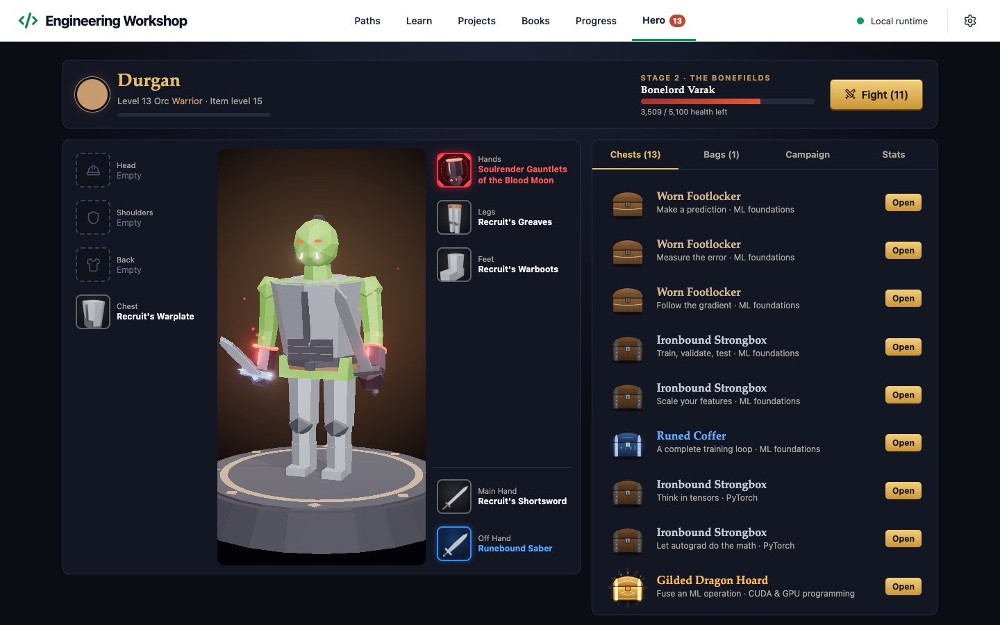

# Engineering Workshop

[](https://github.com/ShmalexM/ml-workshop/actions/workflows/ci.yml)
[](https://github.com/ShmalexM/ml-workshop/releases/latest)
[](LICENSE)

Engineering Workshop is an app for learning machine learning and software engineering by writing code. It has 58 short lessons in 12 paths, from ML basics, PyTorch, TensorFlow and CUDA to agent harnesses, backends and web apps. Each lesson explains one idea, shows a small example, and then runs checks on your own code. It is for programmers who know some Python and want hands-on practice. Everything runs on your computer and works offline after the install, without an account, an API key or a GPU. It is free and open source under the MIT license.


## Install

Paste one line into a terminal and press Enter. You do not need to install anything first, and you do not need admin rights.

**macOS or Linux:** open Terminal and run

```sh
curl -fsSL https://raw.githubusercontent.com/ShmalexM/ml-workshop/main/install.sh | sh
```

**Windows 10 or 11:** open PowerShell from the Start menu and run

```powershell
irm https://raw.githubusercontent.com/ShmalexM/ml-workshop/main/install.ps1 | iex
```

The installer downloads Engineering Workshop, Python 3.12 and the ML libraries (about 2 GB). It also downloads Node.js if your computer does not have version 22.13 or newer. The first install can take a while. When it finishes, Engineering Workshop opens in your browser.

To open it later:

- **macOS:** search for Engineering Workshop in Spotlight. The app is in the Applications folder in your home folder.
- **Linux:** find Engineering Workshop in your applications menu.
- **Windows:** use the Engineering Workshop shortcut in the Start menu or on the desktop.

Everything goes into one folder: `~/.local/share/engineering-workshop` on macOS and Linux, and `%LOCALAPPDATA%\EngineeringWorkshop` on Windows. Your progress is in its `data` folder. Apart from the app shortcuts, nothing else on your computer changes.

- No curl on Linux? Replace `curl -fsSL` with `wget -qO-`.
- PyTorch and TensorFlow no longer support Intel Macs, so on an Intel Mac the installer skips the ML libraries. The PyTorch, TensorFlow, Modern AI stack and CUDA lessons need them. All other lessons work. The installer does the same on any computer where the ML libraries fail to install.
- To update or remove the app, see [How do I update or uninstall?](#how-do-i-update-or-uninstall)

## What's inside

| Path | Lessons | Topics |
| --- | ---: | --- |
| ML foundations | 6 | Predictions, loss, gradients, data splitting, and training |
| PyTorch | 6 | Tensors, broadcasting, autograd, modules, optimization, and inference |
| TensorFlow | 6 | Tensors, GradientTape, Keras, training, datasets, and inference |
| Modern AI stack | 6 | Hugging Face, tokenization, LangChain, LlamaIndex, and retrieval |
| CUDA & GPU programming | 6 | Thread/block indexing, bounds, transfers, 2D kernels, and shared memory |
| Agent harness engineering | 4 | State machines, tool contracts, budgets, and trace evaluation |
| Backend & API engineering | 4 | Input validation, idempotency, pagination, and readiness |
| Web app engineering | 4 | JavaScript reducers, stale responses, derived views, and saved-state migration |
| Reinforcement learning | 4 | Environment contracts, returns, exploration, and terminal/truncated targets |
| Data & retrieval engineering | 4 | Revision deduplication, chunking, bounded graph walks, and recall |
| Shipping & reliability | 4 | Retry budgets, structured redaction, change plans, and release gates |
| Interactive & native systems | 4 | Lifecycle, frame time, aspect ratios, and event replay |

The exercises are in Python, except the Web app engineering lessons, which use JavaScript. A lesson takes about 10 to 20 minutes.

Each lesson has three stages: **Understand**, **See an example** and **Try it yourself**. You read a short explanation, run a small example and answer a question about it. Then you write your own code. **Run code** (⌘ Enter, or Ctrl Enter on Linux and Windows) shows the output. **Check answer** (⌘ Shift Enter, or Ctrl Shift Enter) runs the checks and gives you XP the first time they all pass. Hints open one at a time. **Show solution** works at any time, and **Compare with my code** marks the lines that differ from your draft.

All lessons are open from the start. The **Paths** page suggests an order for four roles, and **All lessons** lists every lesson with filters by path and status. See the [ML learning guide](docs/learning-plan.md).

**Projects** lists 12 public repositories, from Start small to Capstone. Each has a preparation lesson, a link to a starting file and three walkthrough steps. See [Learn from public projects](docs/project-learning.md).

**Books** is a reader for PDF and EPUB files that you import from your own copies with `scripts/import-books.py`. It has search, bookmarks, notes and a saved reading position. If you import Modal's *GPU Glossary* and Philip Kiely's *Inference Engineering*, 15 reading guides link their sections to lessons. The books are not included in this repository. See [Local book library](docs/local-library.md).

## Hero game

Finished work earns rewards in a small fantasy game next to the lessons. The game is optional. Turn it off in **Settings** to hide it completely.

- **Chests.** Every finished lesson, path, project walkthrough and reading guide earns one chest. Harder work earns a better chest. A lesson's chest depends on its path and on how far into the path the lesson is. A finished path earns one of the two best chests.
- **Gear.** You create one hero from 13 World of Warcraft races and 12 classes. Chests hold only gear that your class can use, in five rarities: Basic (white), Common (green), Rare (blue), Epic (red) and Legendary (orange). Better gear looks more ornate on the 3D hero and in your bags. Over the full curriculum, a player opens about 140 items, and about 4 of them are Legendary.
- **Battles.** Each of these chests also earns one fight in a top-down arena. Click to move and attack, and press Q, W, E and R to use your class's abilities. Each stage ends with a boss. A new hero usually loses at first. The damage you deal to a boss carries over between fights, and better gear makes your hero stronger. The **Auto** button plays the fight for you.



The game uses three.js and needs WebGL. Its data is in the same local database as your progress, and progress exports include it.

The race and class names are a nod to World of Warcraft. This project is not affiliated with or endorsed by Blizzard Entertainment. The app makes all of its own art.

## Privacy and safety

- The app runs on your computer. You do not need an account, and the app has no analytics or telemetry.
- The server listens only on `127.0.0.1`, so other computers cannot connect to it. The page in your browser can connect only to that server.
- Your progress, drafts and notes are saved in `workshop.sqlite3` in the `data` folder. **Settings → Export progress and notes** saves a JSON copy. Review it before you share it, because it can contain your notes and project details. JSON import is planned. For a full restore, stop the app and copy back a `data` folder that you saved while the app was stopped.
- The lessons work offline. The framework lessons use small local inputs. They do not download models or call an LLM API.
- Your code runs with your own user account's permissions, as when you run a script yourself. Each exercise runs in a new process and a temporary folder, with a 50-second time limit and a limit on returned output. On macOS and Linux, CPU time and file size are limited too. These limits do not isolate your code from your files, so only run code you trust.

See [SECURITY.md](SECURITY.md) and the [architecture notes](docs/architecture.md) for details.

## FAQ

### Do I need a GPU?

No. The CUDA lessons run your kernels in Numba's CPU simulator, so they work on any computer. You learn thread indexing, bounds checks, memory transfers and shared memory. The simulator does not test compilation, timing or performance on a real NVIDIA GPU. The other lessons use small inputs that run on the CPU. See [CUDA notes](docs/cuda-notes.md).

### Does it send my code or data anywhere?

No. The app has no account, analytics or telemetry. Your code runs on your computer, and your progress stays in the `data` folder. You need the internet only to install or update the app and to open reference links. See [Privacy and safety](#privacy-and-safety).

### Is it free?

Yes. The app and all lessons are free and open source under the [MIT license](LICENSE). No part of the app needs an account, an API key or a paid service.

### How do I update or uninstall?

To update, run the install command again. Your progress is kept.

To uninstall, run the command for your system. This removes the app, and your progress stays in the `data` folder.

```sh
curl -fsSL https://raw.githubusercontent.com/ShmalexM/ml-workshop/main/install.sh | sh -s -- --uninstall
```

```powershell
& ([scriptblock]::Create((irm https://raw.githubusercontent.com/ShmalexM/ml-workshop/main/install.ps1))) -Uninstall
```

To delete your progress as well, add `--purge` (macOS and Linux) or `-Purge` (Windows) at the end.

To update a clone, export your progress, stop the app, run `git pull --ff-only`, and run setup again. Setup keeps the `data` folder.

### Which platforms does it run on?

macOS, Linux, and Windows 10 or 11. On an Apple silicon Mac, all lessons work. On an Intel Mac, the installer skips the ML libraries, so the PyTorch, TensorFlow, Modern AI stack and CUDA lessons do not run. PyTorch and TensorFlow no longer support Intel Macs. On Linux and Windows, the installer also installs the ML libraries.

CI runs on macOS, Linux and Windows for every pull request and every push to `main`. It builds the app and runs the tests. It also installs, updates and uninstalls the app with the one-line installer, without the ML libraries. The ML lessons themselves are tested in CI on Apple silicon Macs only. On Windows, exercises have the time and output limits, but no CPU or file-size limit.

### Can I turn the game off?

Yes. Open **Settings** and turn off **Hero game**. The Hero tab and the reward pop-ups go away. Your progress still earns rewards, so nothing is lost if you turn the game back on later.

## Troubleshooting

- **The install command stops with an error.** It prints the reason and the path of `install.log` in the install folder. Fix the cause, such as a lost internet connection, and run the command again.
- **The app does not open.** Run the install command again. It repairs the app and keeps your progress.
- **Port 7318 is in use.** The app uses port 7318 on `127.0.0.1`. Stop the other program that uses it. If another Engineering Workshop server already runs on that port, the app opens that server.
- **Saving fails after a restart.** The page gets a new session token on its next save. If saving still fails, reload the page.
- **Something else goes wrong.** Look in `server.log` in the `data` folder. Remove personal information before you share it.

## Run from a clone

To change the code, run the app from a Git clone. You need [Node.js](https://nodejs.org/en/download) 22.13 or newer and [Python](https://www.python.org/downloads/) 3.12 or newer.

```sh
git clone https://github.com/ShmalexM/ml-workshop.git
cd ml-workshop
./setup.sh                       # Linux
./"Setup ML Workshop.command"    # macOS
```

On Windows, double-click **Setup Engineering Workshop.cmd** in the cloned folder. Setup creates `.venv`, installs the packages, builds the interface and opens the app at http://127.0.0.1:7318. The repository and the macOS launcher files keep the older ML Workshop name.

[Set up a clone](CONTRIBUTING.md#set-up-a-clone) has the start and stop commands, a light install without the ML libraries, local settings and the optional native Mac window.

## Contributing

Bug reports, lesson fixes and ideas are welcome. Use the [issue forms](https://github.com/ShmalexM/ml-workshop/issues/new/choose) to report a bug or a problem with a lesson. [CONTRIBUTING.md](CONTRIBUTING.md) explains how to add a lesson and run the tests. The [roadmap](ROADMAP.md) lists planned work, and the [changelog](CHANGELOG.md) lists the changes in each release. This project follows a [code of conduct](CODE_OF_CONDUCT.md). Report security problems privately, as [SECURITY.md](SECURITY.md) describes.

## License

[MIT](LICENSE). Dependencies keep their own licenses.

The curriculum and interface are original, AI-assisted work, with links to official documentation for deeper study. The code view, run loader and lesson status chips are adapted from [beautiful-ui](https://github.com/slev12397/beautiful-ui) (MIT, Copyright (c) 2026 Shane Levine); its license is in [THIRD_PARTY_NOTICES.md](THIRD_PARTY_NOTICES.md). The learn-by-doing format is inspired by Boot.dev. This is an independent project with no affiliation with Boot.dev or the authors of the frameworks it teaches.
