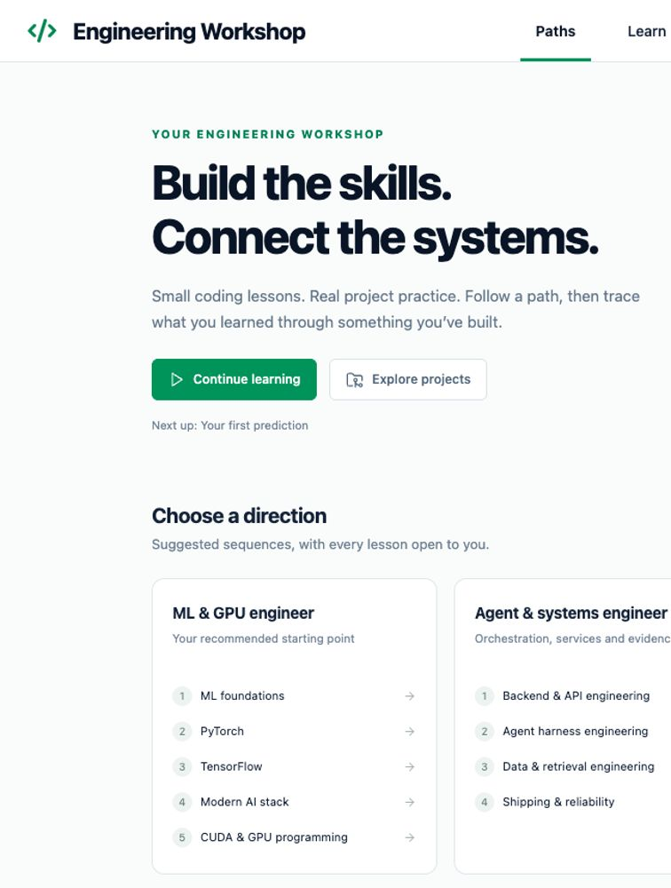
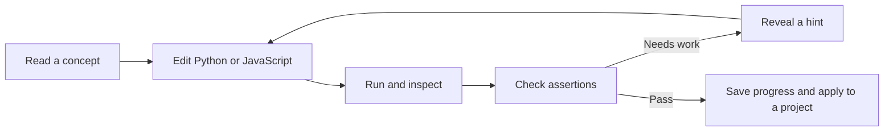

# Engineering Workshop

[](https://github.com/ShmalexM/ml-workshop/actions/workflows/ci.yml)
[](LICENSE)

Learn engineering through **58 checked exercises across 12 paths**, using Python and JavaScript. Study ML, PyTorch, TensorFlow, CUDA, agent harnesses, backends, web apps, reinforcement learning, retrieval, reliability, and interactive systems. Connect the lessons to your own projects with local walkthroughs and notes.

Built for an experienced programmer broadening their engineering skills. The recommended ML path still starts with fundamentals. The repository and existing launcher keep the `ml-workshop` name for compatibility. Inspired by the learn-by-doing format of Boot.dev, with original curriculum and interface. This is an independent project with no affiliation with Boot.dev or the framework authors.



## Quick start: macOS with Apple Silicon

The full application is tested on Apple Silicon Macs with Python 3.12. Windows is not supported yet; full Linux setup is on the [roadmap](ROADMAP.md). Allow several GB of disk space for ML packages. Internet is needed for the first installation; installed lessons run offline.

1. Install [Node.js](https://nodejs.org/en/download) (22.13 or newer; 24 recommended) and [uv](https://docs.astral.sh/uv/getting-started/installation/). If you already use Homebrew: `brew install node uv`.
2. Clone and set up:

   ```sh
   git clone https://github.com/ShmalexM/ml-workshop.git
   cd ml-workshop
   ./"Setup ML Workshop.command"
   ```

   Setup installs Python 3.12 if needed, creates a project virtual environment, installs pinned dependencies, builds the interface, and opens your browser. It does not install Python packages globally.

3. On future visits, double-click **Open ML Workshop.command** in Finder. To add a native app in your user Applications folder and a Desktop shortcut, run once:

   ```sh
   .venv/bin/python scripts/install-launcher.py
   ```

   Then double-click **ML Workshop** to learn. The optional launcher points to this checkout; keep it in the same location. The installer preserves any existing launcher. If you move the checkout, move the old launcher aside before reinstalling.

Once running, open **http://127.0.0.1:7318**. No account, API key, Docker, or cloud service is needed. Closing the browser leaves the local server running; double-click **Stop ML Workshop.command** to stop it. The `.command` files can also be run from Terminal as shown above. Rerun Setup to repair dependencies or rebuild after updating.

## What you'll learn

| Track | Lessons | Topics |
| --- | ---: | --- |
| ML foundations | 6 | Predictions, loss, gradients, data splitting, and training |
| PyTorch | 6 | Tensors, broadcasting, autograd, modules, optimization, and inference |
| TensorFlow | 6 | Tensors, GradientTape, Keras, training, datasets, and inference |
| Modern AI stack | 6 | Hugging Face, tokenization, LangChain, LlamaIndex, and retrieval |
| CUDA Python | 6 | Thread/block indexing, bounds, transfers, 2D kernels, and shared memory |
| Agent harness engineering | 4 | State machines, tool contracts, budgets, and trace evaluation |
| Backend & API engineering | 4 | Input validation, idempotency, pagination, and readiness |
| Web app engineering | 4 | JavaScript reducers, stale responses, derived views, and saved-state migration |
| Reinforcement learning | 4 | Environment contracts, returns, exploration, and terminal/truncated targets |
| Data & retrieval engineering | 4 | Revision deduplication, chunking, bounded graph walks, and recall |
| Shipping & reliability | 4 | Retry budgets, structured redaction, change plans, and release gates |
| Interactive & native systems | 4 | Lifecycle, frame time, aspect ratios, and event replay |



Use **Run code** (⌘ Enter) to inspect output, then **Check answer** (⌘ Shift Enter) for feedback and XP. XP is awarded once per lesson. You can browse any lesson, reveal hints gradually, inspect solutions, and revisit completed work in Practice. Open **Paths** for suggested sequences and **All exercises** for practice. See the [ML learning guide](docs/learning-plan.md).

The **Projects** area maps your codebases to learning paths, with source-tracing prompts, deliverables, notes, and self-reviewed steps. Add or edit your ignored `data/portfolio.json` to keep growing your own map. Fresh clones have no personal catalog. See [project learning and catalog format](docs/project-learning.md).

## Read alongside your exercises

The **Books** area imports your own PDF and EPUB files with search, chapter navigation, bookmarks, notes, and saved reading position. Modal’s *GPU Glossary* and Philip Kiely’s *Inference Engineering* have 15 guided reading stops connected to the exercises. EPUB images keep their original bytes; PDFs retain their vectors, fonts, and images, with zoom rendered from the source.

Books stay local and are not bundled with this repository. See [local library setup and quality notes](docs/local-library.md).

## Your progress stays local

Drafts and notes are cached in the browser and synchronized to SQLite. Completions are saved by the server after checks pass. Your durable state lives in `data/workshop.sqlite3`.

**Settings → Export progress & notes** writes JSON to `data/backups/` and offers a download, including book notes, bookmarks, reading positions, project walkthrough notes, and the local project catalog. Review exports before sharing because project details may be private. The JSON does not include imported book files. Keep this backup somewhere safe. JSON import is planned; for a full current restore, stop the app and restore a copy of the entire `data/` folder made while the server was stopped. Git ignores your data, notes, exports, logs, and environment files.

To update, export progress, stop the app, run `git pull --ff-only`, then rerun Setup. If you are developing on a branch, commit or stash your source edits before integrating updates. Setup preserves `data/`.

## CUDA without an NVIDIA GPU

CUDA Python exercises use **Numba's CPU simulator**. They teach kernel structure and indexing on a Mac. They do not run on an NVIDIA GPU or qualify device compilation, races, warp behavior, occupancy, or performance. Real GPU execution and CUDA C++ are future additions. See [CUDA notes and limitations](docs/cuda-notes.md).

Framework lessons execute real libraries with small local inputs. They do not download pretrained models, call an LLM API, or claim that a tiny exercise establishes production model quality.

## Execution model

**This is a trusted personal-code runner, not a security sandbox.** Python and JavaScript run with your account's filesystem and network permissions. Run code you trust and keep the service local.

The server binds to `127.0.0.1`, checks Host/Origin, and requires a per-session token for writes. Each exercise runs in a fresh Python or Node process and temporary directory with a 50-second wall timeout, CPU/output limits, and process-group cleanup. Only one exercise runs at a time. See [architecture](docs/architecture.md) and [security](SECURITY.md).

## Develop and contribute

The interface uses React, TypeScript, Vite, and CodeMirror. The backend uses Python's HTTP server and SQLite. JavaScript lessons use the already-required Node runtime and its built-in modules. ML packages load only inside exercise processes.

```sh
npm run build     # Type-check and build the frontend
npm test          # Test every lesson, runner behavior, and the local API
npm run dev       # Rebuild on edits; refresh the running app in your browser
```

See [CONTRIBUTING.md](CONTRIBUTING.md) for the development workflow, lesson authoring, and verification. The [roadmap](ROADMAP.md) tracks areas to grow. Bug reports and ideas are welcome in [Issues](https://github.com/ShmalexM/ml-workshop/issues).

## Troubleshooting

- **Setup cannot find uv/npm:** install the prerequisites, reopen Terminal, and rerun Setup.
- **Frontend not built or packages missing:** rerun Setup from the checkout directory.
- **Port 7318 is occupied:** stop the other process using that port or the other ML Workshop instance. The launcher reuses an existing ML Workshop server.
- **Session expired after restart:** reload the browser to get a fresh session token.
- **Unexpected failure:** inspect `data/server.log`. Remove personal information before sharing logs.

## License

[MIT](LICENSE). Dependencies retain their respective licenses. The curriculum and interface are original, AI-assisted work, with links to official documentation for deeper study.
