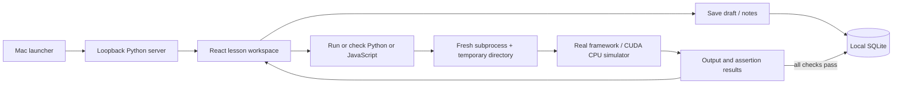

# Architecture

The production frontend is served from `dist/`; only one long-lived Python process is needed. Heavy framework imports live exclusively in exercise subprocesses. Course source and reference checks are backend-owned, published lesson metadata excludes solutions/check expressions, and solutions are fetched only when the user chooses to view them. Every completion is keyed by lesson ID, preventing duplicate XP. SQLite transactions serialize writes and timestamped drafts ignore stale saves.

Execution is deliberately trusted local Python and JavaScript, not an untrusted code service. Loopback host/origin checks, no CORS, an unpredictable write token, subprocess time/output limits, secret-minimized environment, and process-group cleanup reduce accidental misuse but do not isolate the user's filesystem. Do not expose this server on a network.

## Local books

`backend/library.py` imports user-supplied books into ignored `data/library/`. Each manifest contains a text index, navigation, attribution, and allowed assets. EPUB content passes through a tag/attribute whitelist; image bytes are unchanged. The original PDF is preserved and streamed with byte-range support. `pypdf` loads only during PDF import; PDF.js is a lazy browser component with local worker, font, CMap, and WASM assets.

The Books UI uses hash routes for direct chapter links, cancellable PDF rendering, and timestamped reading state in SQLite. Notes, bookmarks, and reviewed guide IDs are included in progress exports; book binaries and extracted content are not. Original study prompts live in `backend/book_study.py` and appear only for matching locally imported books.

Library routes inherit the server's Host/Origin checks and token-protected writes. Assets are manifest-allowlisted and path-confined. Original asset responses prohibit active content; the application CSP allows the local PDF worker and WASM decoder. The app does not execute PDF actions, forms, or EPUB scripts.

## Engineering paths and project practice

`backend/engineering_courses.py` adds original, deterministic engineering lessons. A lesson's language selects Python (the default) or JavaScript. JavaScript runs in a fresh Node process via a Python launcher that sets CPU/file limits before `execve`; the threaded server does not use `preexec_fn`. Both languages share wall timeout, output capture, process-group cleanup and completion rules. Node's VM context organizes exercise/check bindings; it is not a security boundary.

`backend/portfolio.py` validates the bundled public selection in `backend/public_projects.json`, or an optional ignored `data/portfolio.json` override. Fresh clones get the curated public catalog. The public source contains no private project inventory. The server reads only catalog metadata, not the referenced repositories. API responses supply catalog metadata and project state; token-protected writes persist timestamped notes and reviewed step indices in SQLite. Progress export version 3 includes the catalog and project state. Existing lesson IDs, draft caches, book storage and launcher identity remain compatible.

The UI uses hash routes for Paths, lessons, Projects and Books. Suggested sequences do not gate access. A project review is self-assessment and never awards lesson XP. Browser recovery caches survive refresh and stale server writes are rejected.

## Guided learning and answers

`backend/lesson_guides.py` supplies course orientation, vocabulary, prerequisite links and a hand-written small example for each of the 58 lessons. Each example has expected output, a short walkthrough and a prediction question with explanatory feedback. Examples are teaching material, separate from the independent challenge solution and its assertions.

The lesson UI begins in Understand, moves to See an example, then exposes the editor in Try it yourself. Learners can revisit any stage and request an answer immediately without consuming hints. Viewing an answer leaves the draft intact; an explicit Load into editor action replaces it. Course/lesson changes reset the guided stage while preserving stored challenge drafts.

`POST /api/example` uses the server-owned example code, the same local runner and the shared execution lock. It ignores submitted code/mode, passes no completion checks and never writes drafts, completions or activity. Python/JavaScript examples run with the same limits and trust model as challenges. Automated tests execute all examples and compare their actual stdout with the documented result.
