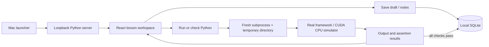

# Architecture

The production frontend is served from `dist/`; only one long-lived Python process is needed. Heavy framework imports live exclusively in exercise subprocesses. Course source and reference checks are backend-owned, published lesson metadata excludes solutions/check expressions, and solutions are fetched only when the user chooses to view them. Every completion is keyed by lesson ID, preventing duplicate XP. SQLite transactions serialize writes and timestamped drafts ignore stale saves.

Execution is deliberately trusted local Python, not an untrusted code service. Loopback host/origin checks, no CORS, an unpredictable write token, subprocess time/output limits, secret-minimized environment, and process-group cleanup reduce accidental misuse but do not isolate the user's filesystem. Do not expose this server on a network.

## Local books

`backend/library.py` imports user-supplied books into ignored `data/library/`. Each manifest contains a text index, navigation, attribution, and allowed assets. EPUB content passes through a tag/attribute whitelist; image bytes are unchanged. The original PDF is preserved and streamed with byte-range support. `pypdf` loads only during PDF import; PDF.js is a lazy browser component with local worker, font, CMap, and WASM assets.

The Books UI uses hash routes for direct chapter links, cancellable PDF rendering, and timestamped reading state in SQLite. Notes, bookmarks, and reviewed guide IDs are included in progress exports; book binaries and extracted content are not. Original study prompts live in `backend/book_study.py` and appear only for matching locally imported books.

Library routes inherit the server's Host/Origin checks and token-protected writes. Assets are manifest-allowlisted and path-confined. Original asset responses prohibit active content; the application CSP allows the local PDF worker and WASM decoder. The app does not execute PDF actions, forms, or EPUB scripts.
