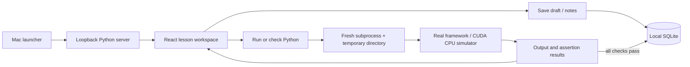

# Architecture

The production frontend is served from `dist/`; only one long-lived Python process is needed. Heavy framework imports live exclusively in exercise subprocesses. Course source and reference checks are backend-owned, published lesson metadata excludes solutions/check expressions, and solutions are fetched only when the user chooses to view them. Every completion is keyed by lesson ID, preventing duplicate XP. SQLite transactions serialize writes and timestamped drafts ignore stale saves.

Execution is deliberately trusted local Python, not an untrusted code service. Loopback host/origin checks, no CORS, an unpredictable write token, subprocess time/output limits, secret-minimized environment, and process-group cleanup reduce accidental misuse but do not isolate the user's filesystem. Do not expose this server on a network.
