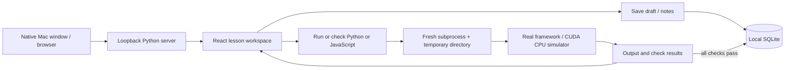

# Architecture

The production frontend is served from `dist/`; only one long-lived Python process is needed. Heavy framework imports live exclusively in exercise subprocesses. Course source and reference checks are backend-owned, published lesson metadata excludes solutions/check expressions, and solutions are fetched only when the user chooses to view them. Every completion is keyed by lesson ID, preventing duplicate XP. SQLite transactions serialize writes and timestamped drafts ignore stale saves.

Execution is deliberately trusted local Python and JavaScript, not an untrusted code service. Loopback host/origin checks, no CORS, an unpredictable write token, subprocess time/output limits, secret-minimized environment, and process-group cleanup reduce accidental misuse but do not isolate the user's filesystem. Do not expose this server on a network.

Run results show learners only their own code. Tracebacks and stacks keep frames from `exercise.py` or `exercise.js`, so runner frames and install paths do not appear, and `summary` gives the error with its line number. `backend/explanations.py` maps common Python and JavaScript errors to one-line `explanation` text. A failed check that is one comparison (`a == b`, `a is True`, `abs(a - b) < tol`, `raises(Error, lambda: a)`, or JavaScript `a === b` and `equal(a, b)`) also returns its `call`, `expected` and `got` values. Check expressions stay out of the curriculum; a learner sees one check's call and expected value only after that check fails.

## Local books

`backend/library.py` imports user-supplied books into ignored `data/library/`. Each book folder has `book.json` (metadata, navigation, attribution and allowed assets) and `chapters/<n>.json` (one page or section each, with its text and sanitized HTML). The server caches only `book.json` summaries and reads chapters from disk per request. A `book.json` from import version 1, which held every chapter, is split into chapter files the first time the server reads it. Imports enforce section, per-file and total output limits while reading (see [Local book library](local-library.md)). EPUB content passes through a tag/attribute whitelist; image bytes are unchanged. The original PDF is preserved and streamed with byte-range support. `pypdf` loads only during PDF import; PDF.js is a lazy browser component with local worker, font, CMap, and WASM assets.

The Books UI uses hash routes for direct chapter links, cancellable PDF rendering, and timestamped reading state in SQLite. Notes, bookmarks, and reviewed guide IDs are included in progress exports; book binaries and extracted content are not. Reading guides live in `backend/book_study.py` and appear only for matching locally imported books.

Library routes inherit the server's Host/Origin checks and token-protected writes. Assets are manifest-allowlisted and path-confined. Original asset responses prohibit active content; the application CSP allows the local PDF worker and WASM decoder. The app does not execute PDF actions, forms, or EPUB scripts.

`POST /api/library/import` streams one raw file to a temporary directory, with a 100 MB limit and a 60-second upload deadline, leaving the smaller exercise JSON limit unchanged. A separate import lock serializes uploads without blocking lesson runs. `backend/book_import.py` parses in a subprocess with a 90-second timeout, checks suggested-book titles, then renames the completed directory into the library. Errors and timeouts clean up staging. Generic IDs derive from file content; duplicates reuse the existing book, and different editions never replace notes or originals. The React import cards update the catalog directly from the response. The native Mac shell supplies a PDF/EPUB file picker through its WebKit UI delegate.

Glossary guides resolve source section keys. Inference guides contain fixed printed-page locators, so they apply only to the verified PDF checksum; other editions and EPUBs remain readable without misleading guide links.

## Engineering paths and project practice

`backend/python_course.py` holds Python from zero, the first path, for learners who have not written Python. It ends with the functions, lists and loops that ML foundations lesson 1 assumes, and every other Python path lists it as a suggested first path.

`backend/engineering_courses.py` adds original, deterministic engineering lessons. A lesson's language selects Python (the default) or JavaScript. JavaScript runs in a fresh Node process via a Python launcher that sets CPU/file limits before `execve`; the threaded server does not use `preexec_fn`. Both languages share wall timeout, output capture, process-group cleanup and completion rules. Node's VM context organizes exercise/check bindings; it is not a security boundary.

`backend/portfolio.py` validates the bundled public selection in `backend/public_projects.json`, or an optional ignored `data/portfolio.json` override. Fresh clones get the curated public catalog; a personal project list belongs in the ignored override. The server reads only catalog metadata, not the referenced repositories. API responses supply catalog metadata and project state; token-protected writes persist timestamped notes and reviewed step indices in SQLite. Progress export version 3 includes the catalog and project state. Existing lesson IDs, draft caches, book storage and launcher identity remain compatible.

The UI uses hash routes for Paths, lessons, Projects and Books. The suggested orders do not gate access. Marking a project step done is self-assessment and never awards lesson XP. Browser recovery caches survive refresh and stale server writes are rejected.

## Guided learning and solutions

`backend/lesson_guides.py` supplies course orientation, vocabulary, prerequisite links and a hand-written small example for each of the 71 lessons. Each example has expected output, a short walkthrough and a prediction question with explanatory feedback. Examples are teaching material, separate from the exercise solution and its checks.

The lesson UI begins in Understand (lesson text only), moves to See an example (text and worked example side by side), then exposes the editor in Try it yourself. The lesson list is a drawer: beside the lesson from 1440px, over it below that. Learners can revisit any stage and open the solution at any time without using hints; it is also the last step after the hints. Viewing the solution leaves the draft intact; Load into editor replaces it. Changing the lesson resets the stage and keeps saved exercise drafts.

`POST /api/example` uses the server-owned example code, the same local runner and the shared execution lock. It ignores submitted code/mode, passes no completion checks and never writes drafts, completions or activity. Python/JavaScript examples run with the same limits and trust model as exercises. Automated tests execute all examples and compare their actual stdout with the documented result.

## Native Mac window

`native/WorkshopApp.swift` is a small AppKit/WKWebView shell, compiled by `scripts/install-launcher.py` without third-party desktop dependencies. Its regular application bundle has a stable `dev.ml-workshop.desktop` identity and the existing Workshop icon. The generated bundle holds the checkout path in an ignored machine-specific Info.plist and is signed ad hoc for local use.

Startup calls the existing single-instance `scripts/launch.py --no-open`, then loads the loopback site. The native shell shares server-side progress/books with browser sessions; WebKit maintains its own draft recovery cache. Only this app's loopback origin loads in the window. HTTP(S) reference links open through the default browser, and downloads use an explicit native Save dialog. Closing the window preserves it for Dock reopening; quitting does not terminate the shared server.

`script/build_and_run.sh` is the developer build/run entrypoint and the Codex Run action. It restarts only the native shell. Installation backs up previous matching app bundles under ignored `.local/launcher-backups/`; it refuses to replace a different bundle ID and never changes learner data. The app is tied to the checkout and is not a notarized, standalone distribution.

## Hero game

The optional game lives in `backend/game.py` and `src/game/`. The server exposes `GET /api/game`, `GET /api/game/summary`, and `POST /api/game/<action>` (hero, open, equip, unequip, discard, settings, retire, battle/start, battle/finish); POST routes use the same token and origin checks as every other write.

Rewards are derived, not stored: on each request the backend lists the chests that saved progress has earned (lessons, completed paths, fully reviewed project walkthroughs, finished reading guides, and cleared boss stages) and subtracts the ones already opened, which are kept by source key. This is why turning the game off loses nothing, and why a chest can never be opened twice. Each earned non-boss source also grants one battle. Opening a chest rolls 1–3 items for the hero's class inside one `BEGIN IMMEDIATE` transaction; `tests/test_game.py` checks class rules, equip rules, the API, and a 1,000-player drop-rate simulation.

The frontend loads three.js only on the Hero page. Heroes, gear, enemies and arenas are built from primitives at runtime; item icons are rendered from the same gear models, so an item looks the same in the bags, on the hero, and in battle. The battle engine (`src/game/battle/engine.ts`) runs the fight on the client and reports damage dealt to the boss when it ends; the server clamps it to the boss's remaining health and persists it.
