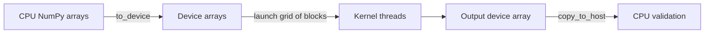

# CUDA learning in ML Workshop

The CUDA track teaches CUDA Python via Numba with `NUMBA_ENABLE_CUDASIM=1`. It executes kernel semantics using CPU threads. It is a teaching and debugging environment, not GPU emulation with realistic timing.

| Concept | CUDA Python | CUDA C++ equivalent |
|---|---|---|
| Thread within a block | `cuda.threadIdx.x` | `threadIdx.x` |
| Block in a grid | `cuda.blockIdx.x` | `blockIdx.x` |
| Threads per block | `cuda.blockDim.x` | `blockDim.x` |
| Global 1D index | `cuda.grid(1)` | `blockIdx.x * blockDim.x + threadIdx.x` |
| Launch | `kernel[blocks, threads](args)` | `kernel<<<blocks, threads>>>(args)` |
| Bounds guard | `if i < n:` | `if (i < n) { ... }` |
| Shared block memory | `cuda.shared.array(...)` | `__shared__` array |
| Block synchronization | `cuda.syncthreads()` | `__syncthreads()` |

Memory flow:

In this app, the device-array operations above are simulated in host memory. Never report the resulting timing as GPU timing.

A future GPU track needs a separately selected NVIDIA machine, compatible driver/toolkit and Python packages, then device compilation and numerical validation of every kernel. Disable the simulator only in that verified environment. CUDA API support in simulation does not prove device compilability. Validate synchronization with actual hardware tools, measure after warmup with CUDA events and synchronization, compare against vectorized CPU and framework baselines, then inspect occupancy and memory access with NVIDIA profiling tools. This app does not provision a GPU or incur cloud charges.

The built-in CUDA target in Numba is deprecated in favor of NVIDIA's `numba-cuda` package. The supported macOS environment pins a tested Numba release containing the CPU simulator; a future GPU environment should follow current NVIDIA installation guidance rather than assume this lockfile transfers unchanged.

Sources: [NVIDIA Numba simulator](https://nvidia.github.io/numba-cuda/user/simulator.html), [NVIDIA CUDA Python programming guide](https://docs.nvidia.com/cuda/cuda-programming-guide/02-basics/intro-to-cuda-python.html), [Numba CUDA target notice](https://numba.readthedocs.io/en/stable/cuda/index.html).
