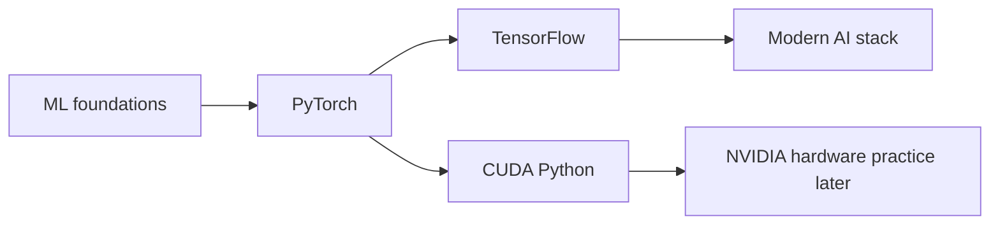

# How to use the ML paths

Use one lesson per sitting. Ten to twenty focused minutes is a useful starting point; the in-app times are estimates rather than deadlines.

1. Read the short explanation and diagram. Predict what the starter code will output.
2. Run the starter code, then write your solution. Use print statements to inspect shapes and values.
3. Check your answer. Treat failed assertions as clues about the behavior you need.
4. Write two sentences in Notes: what the concept does and a mistake to avoid.
5. On your next visit, redo the previous lesson without its solution before continuing.

Progression:

Start with the six foundation lessons. They make loss functions, gradients, data splitting and training loops concrete in Python. PyTorch and TensorFlow then solve the same kinds of problems so you can distinguish concepts from API names. The modern AI lessons use the real libraries locally, with untrained models and no LLM calls. CUDA kernels run in Numba's CPU simulator; compiling and timing them on an NVIDIA GPU is separate practice.

At each capstone, change the data or inputs and explain the resulting behavior. A passed exercise alone is not job readiness; use these exercises to build the foundation for a larger project, documented evaluation and real deployment experience.
