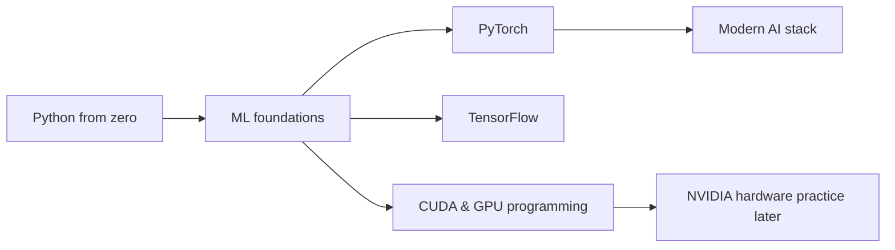

# How to use the ML paths

Use one lesson per sitting. Ten to twenty focused minutes is a useful starting point; the in-app times are estimates rather than deadlines.

1. **Understand:** read the explanation and the diagram.
2. **See an example:** answer the prediction question, then run the example to confirm it.
3. **Try it yourself:** run the starter code, then write your solution. Use print statements to inspect shapes and values.
4. Select **Check answer**. Treat each failed check as a clue about the behavior you need.
5. Write two sentences in Notes: what the concept does and a mistake to avoid. On your next visit, redo the previous lesson without its solution before continuing.

Progression:

If you have not written Python before, start with the 13 lessons of Python from zero. They cover variables, functions, lists, loops, dictionaries, errors and imports, and end where ML foundations begins. Then take the six foundation lessons. They make loss functions, gradients, data splitting and training loops concrete in Python. PyTorch and TensorFlow then solve the same kinds of problems so you can distinguish concepts from API names. The modern AI lessons use the real libraries locally, with untrained models and no LLM calls. The CUDA path needs only ML foundations and basic NumPy arrays. Its kernels run in Numba's CPU simulator; compiling and timing them on an NVIDIA GPU is separate practice.

In the last lesson of each path, change the data and explain what changes. Then take the idea to a project.
