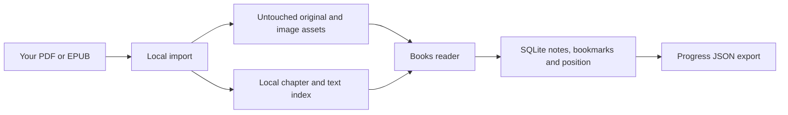

# Local book library

Open **Books** in Engineering Workshop. Imported PDFs and EPUBs are available offline, with chapter navigation, text search, bookmarks, reading notes, and a saved page or section. The two suggested books also have reading guides that link to related lessons.

## Import your own copy

Open **Books**. The **GPU Glossary** and **Inference Engineering** cards each have a drop area and **Choose file** button. Drop one PDF or EPUB onto the matching card, or choose it from your computer. **Read on Modal** opens the online glossary; **Get a free copy** opens Baseten's download page. The app does not download or bundle either book for you.

Uploads show progress, followed by a chapter/search preparation step. When **Ready to read** appears, choose **Read book** or **Open book**; no reload or terminal command is needed. On the Mac app, **Choose file** opens a native file picker.

Use **Add another book** for any other PDF or EPUB, or to keep a second edition. Reimporting the same file returns the existing copy without resetting notes or reading position.

**Remove book** on a book's card deletes the copy stored in `data/library/<id>/` after you confirm. It does not delete the file you imported, and your notes, bookmarks and reading position stay in the progress database, so importing the same file again brings them back. A different edition cannot overwrite a suggested book; import it separately instead. Files must be non-empty and no larger than 100 MB. Invalid, encrypted, or interrupted imports show an error and can be retried without changing existing books.

PDFs preserve their original printed layout, fonts and diagrams. EPUBs use a responsive reading layout and retain original image resolution. Reading guides appear only when their locations match: glossary section keys for EPUB, and the verified PDF edition for *Inference Engineering*. Other editions and formats still support reading, search, notes and bookmarks.

### Optional command-line import

In a clone, run Setup first, then import from the project directory:

```sh
.venv/bin/python scripts/import-books.py \
  --epub "$HOME/Downloads/GPU-Glossary.epub" \
  --pdf "$HOME/Desktop/Inference Engineering.pdf"
```

Use either option separately if you only have one book. For another book:

```sh
.venv/bin/python scripts/import-books.py --file "/path/to/book.pdf" --id my-book
```

In a copy made by the install command, run the importer with the Python in its `app` folder. On macOS and Linux:

```sh
~/.local/share/engineering-workshop/app/.venv/bin/python \
  ~/.local/share/engineering-workshop/app/scripts/import-books.py --epub "$HOME/Downloads/GPU-Glossary.epub"
```

On Windows, in PowerShell:

```powershell
& "$env:LOCALAPPDATA\EngineeringWorkshop\app\.venv\Scripts\python.exe" `
  "$env:LOCALAPPDATA\EngineeringWorkshop\app\scripts\import-books.py" --pdf "$HOME\Desktop\Inference Engineering.pdf"
```

Books then go into the `data` folder next to `app`, so updates keep them.

Reload the app after importing. The importer copies the original into `data/library/<id>/`, builds a local text index, and prints its SHA-256 checksum. It never modifies the supplied file. Reimporting an identical edition is safe; an older index format is rebuilt when needed. Use a new ID for a different edition so existing reading positions remain meaningful.

PDF import uses `pypdf`; the browser renders with a locally bundled PDF.js worker, fonts, character maps, color profiles, and decoders. Setup installs these dependencies. Reading does not use a CDN or a remote document service.

## Read and study

- Search from the Books page to search the library, or within a book to narrow results. Search requires two characters and returns up to 60 matching pages or sections.
- Use Contents or the page field to navigate. For PDFs, the page field counts physical pages; the reader also displays the book's printed page label. The table of contents uses printed labels.
- Open **Reading guides** for suggested readings, a reading question, and a related lesson. **Mark reviewed** records your own review; it does not award lesson XP.
- Use the bookmark button and **Saved** tab to return to useful sections. **Reading notes** holds notes for the whole book.
- Related lessons show a **Related reading** list when the matching books are imported.

## Figure quality

EPUB image assets are copied byte-for-byte, including their original resolution and format. Click or keyboard-activate an illustration to enlarge it, see its pixel dimensions, or open the image file. Zooming a raster picture cannot add detail absent from the source.

PDF pages are rendered directly from the original PDF, preserving its vector diagrams, embedded fonts, and source image streams. Zoom rerenders the page at the selected size, rather than enlarging a saved screenshot. Rendering respects display pixel density, with a 24-million-pixel canvas limit. **Download PDF** saves the untouched file for other viewing or printing tools, including browsers without a built-in PDF viewer.

The EPUB reader adapts typography and strips executable content, source styles, and remote images. Captions, source links, and image attribution remain in the reading content. Complex EPUB layout, MathML, audio/video, and arbitrary embedded documents are not supported. PDF search and selectable text depend on an existing text layer; scanned pages are viewable but no OCR is performed.

## Storage, backups, and source rights



Original files, extracted text, and images stay in the Git-ignored `data/library/` directory. Reading position, notes, bookmarks, and guide review status are stored in `data/workshop.sqlite3`, with a browser cache for pending saves. **Settings → Export progress and notes** includes reading state in version 3 JSON exports (alongside project notes and the local project catalog). It does not include the book files. For a full restore, stop the app and back up the entire `data/` directory. JSON import is not yet implemented.

The app's MIT license covers the app source and its reading guides. Imported books and figures retain their own rights and are not distributed with the repository. Obtain your own copies of [Modal's GPU Glossary](https://modal.com/gpu-glossary) and *Inference Engineering* by Philip Kiely. The glossary's supplied license covers its Markdown text under CC BY 4.0; individual figure attributions still apply. The supplied *Inference Engineering* PDF is copyrighted by Baseten Labs Inc.

Browser imports go only to the local Workshop server, with the same Host/Origin and session-token checks as other writes. One upload runs at a time, with a 100 MB input limit, a 60-second upload limit and a 90-second parsing limit. Parsing runs in a disposable subprocess and publishes only a complete book; failed imports remove temporary files, and staging folders left by a stopped server are removed at a later import. EPUB limits: 250 MB of unpacked files, 2,000 sections (a section listed more than once is kept once), 8 MB per unpacked file, and 64 MB of extracted text and markup for the whole book. PDF limits: 10,000 pages and 64 MB of extracted text. An import over a limit stops with a message that names the limit. The reader sanitizes EPUB markup, prefixes the book's class names and ids with `bk-` so they cannot match the app's own styles, keeps the chapter inside its page area, and serves only manifest-listed assets. A source link from the EPUB metadata is kept only if it is an http or https URL. This is a personal library, not a public document hosting service.
