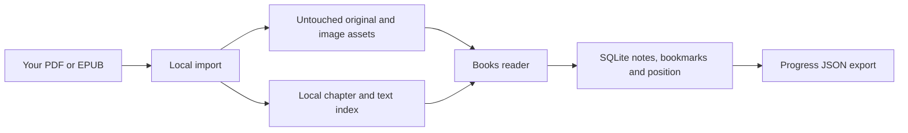

# Local book library

Open **Books** in ML Workshop. Imported PDFs and EPUBs are available offline, with chapter navigation, text search, bookmarks, reading notes, and a saved page or section. The two suggested books also have original study prompts and links to related coding exercises.

## Import your own copy

Run Setup first, then import from the project directory:

```sh
.venv/bin/python scripts/import-books.py \
  --epub "$HOME/Downloads/GPU-Glossary.epub" \
  --pdf "$HOME/Desktop/Inference Engineering.pdf"
```

Use either option separately if you only have one book. For another book:

```sh
.venv/bin/python scripts/import-books.py --file "/path/to/book.pdf" --id my-book
```

Reload the app after importing. The importer copies the original into `data/library/<id>/`, builds a local text index, and prints its SHA-256 checksum. It never modifies the supplied file. Reimporting an identical edition is safe; an older index format is rebuilt when needed. Use a new ID for a different edition so existing reading positions remain meaningful.

PDF import uses `pypdf`; the browser renders with a locally bundled PDF.js worker, fonts, character maps, and decoders. Setup installs these dependencies. Reading does not use a CDN or a remote document service.

## Read and study

- Search from the Books page to search the library, or within a book to narrow results. Search requires two characters and returns up to 60 matching pages or sections.
- Use Contents or the page field to navigate. For PDFs, the page field counts physical pages; the reader also displays the book's printed page label. The table of contents uses printed labels.
- Open **Study path** for suggested readings, explain-back prompts, and a connected exercise. **Mark reviewed** records your own review; it does not award coding XP or claim mastery.
- Use the bookmark button and **Saved** tab to return to useful sections. **My reading notes** holds notes for the whole book.
- Relevant coding lessons include **Read alongside this lesson** links when the matching books are imported.

## Figure quality

EPUB image assets are copied byte-for-byte, including their original resolution and format. Click or keyboard-activate an illustration to enlarge it, inspect its native dimensions, or open the original image. Zooming a raster picture cannot add detail absent from the source.

PDF pages are rendered directly from the original PDF, preserving its vector diagrams, embedded fonts, and source image streams. Zoom rerenders the page at the selected size, rather than enlarging a saved screenshot. Rendering respects display pixel density, with a 24-million-pixel canvas limit. **Download PDF** saves the untouched file for other viewing or printing tools, including browsers without a built-in PDF viewer.

The EPUB reader adapts typography and strips executable content, source styles, and remote images. Captions, source links, and image attribution remain in the reading content. Complex EPUB layout, MathML, audio/video, and arbitrary embedded documents are not supported. PDF search and selectable text depend on an existing text layer; scanned pages are viewable but no OCR is performed.

## Storage, backups, and source rights



Original files, extracted text, and images stay in the Git-ignored `data/library/` directory. Reading position, notes, bookmarks, and guide review status are stored in `data/workshop.sqlite3`, with a browser cache for pending saves. **Settings → Export progress & notes** includes reading state in version 3 JSON exports (alongside project notes and the local project catalog). It does not include the book files. For a full restore, stop the app and back up the entire `data/` directory. JSON import is not yet implemented.

The app's MIT license covers the app source and its original study prompts. Imported books and figures retain their own rights and are not distributed with the repository. Obtain your own copies of [Modal's GPU Glossary](https://modal.com/gpu-glossary) and *Inference Engineering* by Philip Kiely. The glossary's supplied license covers its Markdown text under CC BY 4.0; individual figure attributions still apply. The supplied *Inference Engineering* PDF is copyrighted by Baseten Labs Inc.

Book import is a local CLI operation for trusted files, with a 100 MB input limit and a 250 MB expanded EPUB limit. The reader sanitizes EPUB markup and serves only manifest-listed assets behind the existing loopback Host/Origin checks. This is a personal library, not a public document hosting service.
