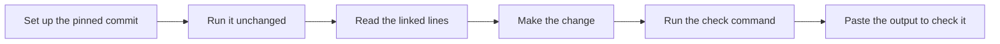

# Learn from public projects

The Projects tab ships with **12 public repositories**, covering every path except Python from zero, from Start small to Capstone. Each project is pinned to one commit. It has a goal, prerequisite lessons and tools, time estimates, setup commands for macOS/Linux and Windows, a run step with its expected output, 3 to 5 tasks, one stretch task and a list of known problems. Each task links to a line range in the pinned source, says what to change, and gives a command with the output you should see.



## The selection

| Level | Project | First task | Time | Runs on |
| --- | --- | --- | --- | --- |
| Start small | [micrograd](https://github.com/karpathy/micrograd): add two operations | Break gradient accumulation on purpose | 1 h 35 min | macOS, Linux, Windows |
| Start small | [TodoMVC](https://github.com/tastejs/todomvc): keep todos after a reload | Save the todos and load them on start | 1 h 55 min | macOS, Linux, Windows |
| Start small | [Gymnasium](https://github.com/Farama-Foundation/Gymnasium): beat random play on CartPole | Score random play on 20 seeds | 1 h 30 min | macOS, Linux, Windows |
| Build next | [PyTorch examples](https://github.com/pytorch/examples): make a regression run repeatable | Make two runs print the same line | 1 h 25 min | macOS, Linux, Windows |
| Build next | [Keras](https://github.com/keras-team/keras-io): train a convnet on CPU with JAX | Account for every parameter, then flatten | 1 h 40 min | macOS, Linux, Windows |
| Build next | [smolagents](https://github.com/huggingface/smolagents): test the agent loop with a scripted model | Call a tool that does not exist | 2 h 5 min | macOS, Linux, Windows |
| Build next | [LlamaIndex](https://github.com/run-llama/llama_index): chunk documents and measure retrieval | Split one document into linked chunks | 1 h 55 min | macOS, Linux, Windows |
| Build next | [Temporal](https://github.com/temporalio/samples-python): test a retrying activity | Predict the retries, then cap them | 2 h 15 min | macOS, Linux, Windows; needs the Temporal CLI |
| Build next | [NVIDIA cuda-samples](https://github.com/NVIDIA/cuda-samples): port vectorAdd to Numba's simulator | Port vecAdd and remove its guard | 1 h 40 min | macOS, Linux, Windows; no GPU needed |
| Capstone | [Full Stack FastAPI Template](https://github.com/fastapi/full-stack-fastapi-template): page items by cursor | Show that offset paging repeats an item | 2 h 20 min | macOS, Linux, Windows; needs Docker |
| Capstone | [Stable-Baselines3](https://github.com/DLR-RM/stable-baselines3): train an agent you can trust | Score a random policy before you train | 3 h 30 min | macOS, Linux, Windows |
| Capstone | [Vigil at Home](https://github.com/ShmalexM/Vigil-at-Home): prove the AI advises but never acts | Test every release action for the AI and for rules | 2 h 20 min | macOS, Linux |

Every link points to a commit SHA, so line numbers do not move when upstream changes. To update a project, pick a new commit, check every line range and command again, and give the entry a new ID (see below).

## How the entries were checked

On 2026-10-08, each pin and every cited file and line range was checked at its commit with the GitHub API. The setup, the run step and the task checks were run on macOS (arm64) at the pin, and the expected output in each task is the output seen there. Each project's **How this was checked** note says what ran. Windows commands were written but not run.

Details:

- **micrograd**, **Temporal** and **Stable-Baselines3** were run in full, including every stretch task and the failing state before each fix. The setup, run step and first task of micrograd and Stable-Baselines3 were run a second time. Temporal needs the Temporal CLI.
- **Full Stack FastAPI Template**: the backend tests ran against a standalone Postgres 18 container on another port. `docker compose up -d db`, the full Compose stack and the page in a browser were not run.
- **NVIDIA cuda-samples**: the Python port ran in Numba's CUDA simulator. `vectorAdd.cu` was not built or run (no NVIDIA GPU).
- **Vigil at Home** runs on macOS and Linux only; it was run on macOS.
- **PyTorch** and **Stable-Baselines3**: the Linux CPU-wheel install command was not run.
- PokeRL was replaced by Stable-Baselines3. PokeRL has a README and no code or license yet; the Stable-Baselines3 stretch task keeps its lesson that reward is not progress.

The app never installs, runs or bundles these repositories. You run the commands in your own terminal.

## Tasks and checks

- **Tick a task** when you have made the change and run its check. Ticks and notes are saved on this computer.
- **Paste your output** is optional. The page compares the pasted text with the task's check, either a fixed string (`contains`) or a regular expression (`regex`, with the `m` flag). Windows line endings and trailing spaces are ignored. The check runs in the browser. The pasted text is not sent to the local server and is not stored; only the time the check passed is saved.
- **Notes for this task** save with the project.
- **The stretch task** is optional. It has notes and a check but does not count toward finishing the project.

Setup and Run it are open on a new project. After you tick a task or write a note, they start collapsed on your next visit. One task is open at a time.

## Hero chests

With the Hero game on, a project earns one chest when every task is ticked. The level sets the chest: Start small pays tier 2, Build next tier 3 and Capstone tier 4. If every task that has a check also has a passing check recorded when you open the chest, the chest is one tier better, up to tier 5. The check only compares text you paste, so it is a self-check.

Projects without tasks (a local catalog with walkthrough steps) earn a chest when every step is ticked.

## Extend the shared catalog

The catalog lives in `backend/public_projects.json` and keeps `"version": 1`. Add public project metadata and your own tasks, not copied repository code. A useful project has a small source slice, a link to an existing path and a result you can check with a command.

Each project has the original fields (`id`, `title`, `summary`, `tracks`, `level`, `firstLesson`, `repoUrl`, `entryPoint`, `why`, `requirements`, `evidence`, `deliverable`) and these optional hands-on fields:

| Field | Meaning |
| --- | --- |
| `goal` | One or two sentences: the result |
| `pin` | `{"ref": <40-character commit SHA>, "label": "main, 2026-10-08"}`; required with `tasks` |
| `prerequisites` | `{"lessons": [lesson IDs], "projects": [project IDs], "tools": [text]}` |
| `minutes` | `{"setup", "tasks", "stretch"}` in minutes; `tasks` defaults to the sum of task minutes |
| `platforms` | Some of `"macos"`, `"linux"`, `"windows"`; default all three. Without `"windows"`, `setup.windows` must be empty |
| `setup` | `{"unix": [commands], "windows": [PowerShell commands]}` |
| `run` | A check object (below) for the unchanged code |
| `tasks` | 1 to 8 tasks |
| `stretch` | One optional task that does not count toward finishing |
| `troubleshooting` | Up to 12 `{"problem", "fix"}` items |

A task has `id` (slug, unique in the project), `title`, `minutes`, `lessons`, `source` (`{"path": "micrograd/engine.py", "lines": [13, 22]}`), `do`, `change`, an optional `starter` (`{"path", "text"}`) and `verify`. A check object (`verify` or `run`) has `commands`, `expect` (the real output), an optional `paste` hint and an optional `check`: `{"type": "contains", "value": "3 passed"}` or `{"type": "regex", "pattern": "^loss 0\\.0000"}`.

The loader rejects the whole catalog with a message that names the project and field when something is wrong, for example `public-micrograd-ops.tasks[0].source.lines: expected [first, last] with 1 <= first <= last`. It checks that lesson and project IDs exist, that paths are relative and have no `..`, that the pin is a full SHA, and that each regex is at most 300 characters, compiles, and uses no Python-only syntax such as `(?P<name>...)`. It builds each source link as `{repoUrl}/blob/{pin.ref}/{path}#L{first}-L{last}` and sets the walkthrough `steps` to the task titles, so ticks, exports and chests use the same indices.

Before you add an entry, run its setup, run step and every task check at the pin, and put the output you saw in `expect`.

Keep project IDs and task order stable once learners have progress. If the tasks change, use a new ID so old ticks do not apply to new tasks. Ticking a task records the learner's own assessment and does not award lesson XP.

## Optional local customization

A Git-ignored `data/portfolio.json` overrides the bundled catalog when present. Without it, every fresh clone gets the public selection. To return to the default, move the override aside and refresh. The app never scans or executes referenced repositories. A local entry can use walkthrough `steps` instead of tasks:

```json
{
  "version": 1,
  "coverage": "My own optional learning map",
  "projects": [
    {
      "id": "example-service",
      "title": "Example service",
      "summary": "Study a small API contract.",
      "visibility": "local",
      "repoUrl": "",
      "localPath": "/path/to/example-service",
      "tracks": ["backend"],
      "level": "Start small",
      "firstLesson": "backend-1",
      "entryPoint": {"label": "Read the local README", "url": ""},
      "why": "One request handler is a small enough unit to trace.",
      "requirements": "Python functions and dictionaries.",
      "evidence": "README inspected; runtime not tested.",
      "steps": ["Trace input validation.", "Describe an invalid request.", "Write an acceptance test."],
      "deliverable": "A request contract and one test case."
    }
  ]
}
```

Valid path IDs: `python`, `foundations`, `pytorch`, `tensorflow`, `modern`, `cuda`, `harness`, `backend`, `web`, `rl`, `data`, `reliability`, `interactive`. IDs must be unique lowercase slugs. Use 1–8 walkthrough steps or tasks and HTTPS GitHub URLs. Visibility is descriptive, not an access-control boundary; this remains a personal loopback app.

## Progress and backups

Project notes, ticked tasks and per-task notes and check times save locally to SQLite (`project_state`, with a `tasks` column added on first start) with browser-cache recovery and stale-write protection. Pasted output is never saved.

The 2026-10-08 catalog replaced all 12 earlier walkthroughs with new IDs. Notes and ticks for the old IDs stay in the database; the Projects page lists them under **Retired projects**, read-only, and a finished old walkthrough keeps its tier-3 chest. Opened chests and their items do not change.

Settings → Export progress and notes includes project notes, ticks, per-task notes and check times, and the active catalog, alongside lesson and reading state. Notes may contain personal information; review an export before sharing. Source code and book files are not included. The app keeps the 10 newest exports in `data/backups`. For a full restore, back up the entire `data/` folder while the app is stopped.
