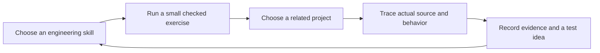

# Learn through a project

The workshop has two connected layers: reusable coding paths and local project walkthroughs. A walkthrough asks you to find the corresponding behavior in a real codebase, record evidence, and explain a tradeoff. Its review checkboxes are self-assessment, separate from checked lesson completions and XP.



## Add or extend your project map

Create `data/portfolio.json`. The app loads it when you refresh; no rebuild or server restart is needed. There is no automatic GitHub scan, repository execution, or cloud upload. The file is ignored by Git, so private project details stay local. A fresh clone starts with an empty Projects view.

```json
{
  "version": 1,
  "updatedAt": "2026-10-05",
  "coverage": "A manually reviewed example repository.",
  "projects": [
    {
      "id": "example-service",
      "title": "Example service",
      "summary": "A small API and browser client for studying request contracts and asynchronous state.",
      "visibility": "local",
      "repoUrl": "",
      "localPath": "/path/to/example-service",
      "tracks": ["backend", "web", "reliability"],
      "evidence": "README and request handler inspected. Deployment behavior not tested.",
      "steps": [
        "Trace one request from UI input to validated API payload and response.",
        "Design a duplicate-request fixture and explain what must remain unchanged.",
        "Record how a delayed response should behave after the user changes the query."
      ],
      "deliverable": "A request sequence diagram and three behavioral acceptance criteria."
    }
  ]
}
```

IDs must be unique lowercase slugs. Supported path IDs are `foundations`, `pytorch`, `tensorflow`, `modern`, `cuda`, `harness`, `backend`, `web`, `rl`, `data`, `reliability`, and `interactive`. Use 1–8 walkthrough steps, an optional HTTPS GitHub repository URL, and visibility `public`, `private`, or `local`. Visibility is a descriptive label, not an access-control setting; the entire app is a personal loopback service.

Keep a project's ID and step order stable after recording progress. If you replace the walkthrough with materially different steps, use a new project ID so old review checks are not applied to different work. The server validates the catalog and shows an actionable error instead of rendering a partial or malformed map.

## Evidence and ownership

Describe what you actually inspected: metadata, README, selected source, tests, or observed runtime behavior. A repository description is not proof that its planned features exist. Forks and adapted projects should credit upstream authors. Do not use project mappings as claims of sole authorship, production readiness, or verified deployment.

Project paths are displayed as reference text. The server does not expose a general file reader or open, scan, train, deploy, or modify the referenced project. Use synthetic fixtures when turning a walkthrough into a coding experiment.

## Persistence

Project notes and reviewed step indices save to `project_state` in SQLite, with browser-cache recovery and timestamp ordering. **Settings → Export progress & notes** includes the local project catalog and project notes, in addition to lesson and reading progress. An export may therefore contain private project details: review it before sharing. Source code and book binaries are not included. A full backup remains a stopped-server copy of `data/`.

## Scope of the new paths

The new four-lesson paths introduce specific invariants; they are not complete professional certifications. Web lessons run JavaScript functions in Node, rather than rendering a browser UI. Interactive/native lessons use Python to model lifecycle, time and media geometry; they do not teach the full SwiftUI or Flutter APIs. RL lessons use a tiny deterministic environment and tabular updates; real emulator training and PPO are project follow-ups. CUDA remains CPU simulation.
