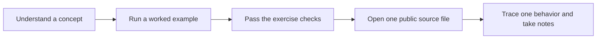

# Learn from public projects

The Projects tab ships with **12 curated public repositories**, covering every path except Python from zero. Each entry has a level, a preparation lesson, a specific starting file, prerequisites and three walkthrough steps. Follow a small slice of a codebase before trying to run or understand the whole application.



## The selection

| Level | Project | Starting point |
| --- | --- | --- |
| Start small | [micrograd](https://github.com/karpathy/micrograd) | Scalar operations and backward callbacks |
| Start small | [TodoMVC](https://github.com/tastejs/todomvc) | React reducer and a single UI action |
| Start small | [Gymnasium](https://github.com/Farama-Foundation/Gymnasium) | CartPole’s environment contract |
| Build next | [PyTorch examples](https://github.com/pytorch/examples) | Synthetic regression training loop |
| Build next | [Keras guides](https://github.com/keras-team/keras-io) | Introduction for engineers |
| Build next | [smolagents](https://github.com/huggingface/smolagents) | Agent loop and tool boundaries |
| Build next | [Full Stack FastAPI Template](https://github.com/fastapi/full-stack-fastapi-template) | One item route and its browser client |
| Build next | [LlamaIndex](https://github.com/run-llama/llama_index) | Document and node schema |
| Build next | [Temporal Python samples](https://github.com/temporalio/samples-python) | One activity retry example |
| Build next | [NVIDIA CUDA samples](https://github.com/NVIDIA/cuda-samples) | Native vector-add sample |
| Capstone | [PokeRL](https://github.com/ShmalexM/PokeRL) | Credited [PokemonRedExperiments](https://github.com/PWhiddy/PokemonRedExperiments) environment implementation |
| Capstone | [Vigil at Home](https://github.com/ShmalexM/Vigil-at-Home) | Desktop alert flow and authority boundaries |

Public visibility, README context and starting-file paths were checked on 2026-10-05. Links follow upstream branches and can move. Upstream installation and runtime behavior were not tested. Source reading comes first; each card explains additional requirements such as a model provider, database, NVIDIA GPU or user-supplied game assets.

The PokeRL repository currently contains a brief README; its walkthrough explicitly links to the credited upstream implementation. No game assets, repository source code or third-party dependencies are bundled. Each project's **How this was checked** note says what was inspected and that nothing was installed or run.

## Extend the shared catalog

The reusable catalog lives in `backend/public_projects.json`. Add public project metadata and your own walkthrough steps, not copied repository code. Verify the entry-point URL and identify a small, teachable behavior. A useful project should have an approachable source slice, a connection to an existing path and a concrete deliverable. Large projects belong after the smaller examples.

Keep project IDs and step order stable once learners have progress. If the walkthrough changes materially, use a new ID so old step progress does not apply to new steps. Marking a step done records the learner’s own assessment and does not award lesson XP.

## Optional local customization

A Git-ignored `data/portfolio.json` overrides the bundled catalog when present. Without it, every fresh clone gets the public selection. To return to the default, move the override aside and refresh. The app never scans or executes referenced repositories.

```json
{
  "version": 1,
  "coverage": "My own optional learning map",
  "projects": [
    {
      "id": "example-service",
      "title": "Example service",
      "summary": "Study a small API contract.",
      "visibility": "local",
      "repoUrl": "",
      "localPath": "/path/to/example-service",
      "tracks": ["backend"],
      "level": "Start small",
      "firstLesson": "backend-1",
      "entryPoint": {"label": "Read the local README", "url": ""},
      "why": "One request handler is a small enough unit to trace.",
      "requirements": "Python functions and dictionaries.",
      "evidence": "README inspected; runtime not tested.",
      "steps": ["Trace input validation.", "Describe an invalid request.", "Write an acceptance test."],
      "deliverable": "A request contract and one test case."
    }
  ]
}
```

Valid path IDs: `python`, `foundations`, `pytorch`, `tensorflow`, `modern`, `cuda`, `harness`, `backend`, `web`, `rl`, `data`, `reliability`, `interactive`. IDs must be unique lowercase slugs. Use 1–8 walkthrough steps and HTTPS GitHub URLs. Visibility is descriptive, not an access-control boundary; this remains a personal loopback app.

## Progress and backups

Notes and reviewed step indices save locally to SQLite with browser-cache recovery and stale-write protection. Replacing a catalog does not delete old project notes from the database. New catalog entries use separate IDs so old step progress does not transfer to different projects.

Settings → Export progress and notes includes project notes and the active catalog, alongside lesson and reading state. A local override or old notes may contain personal information; review an export before sharing. Source code and book files are not included. For a full restore, back up the entire `data/` folder while the app is stopped.
